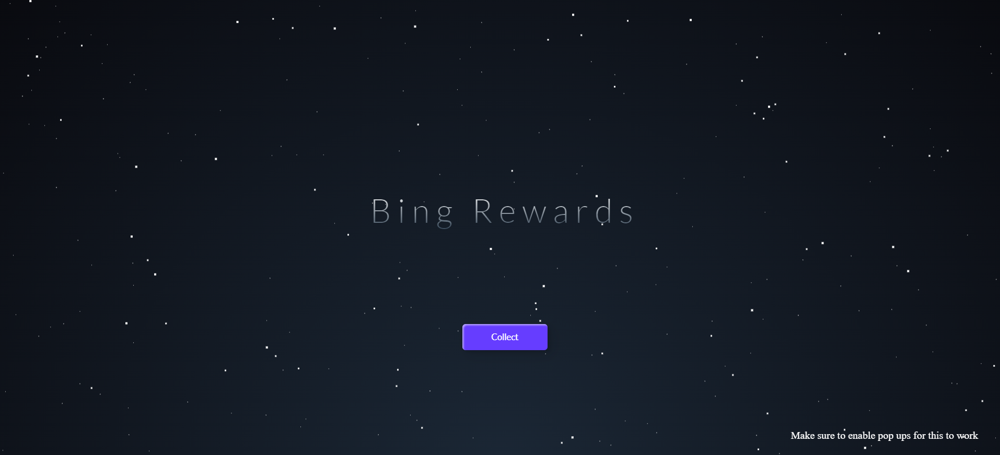
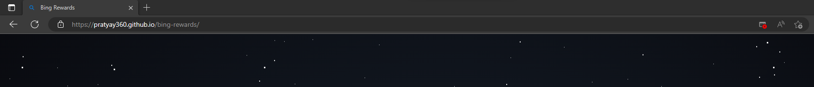
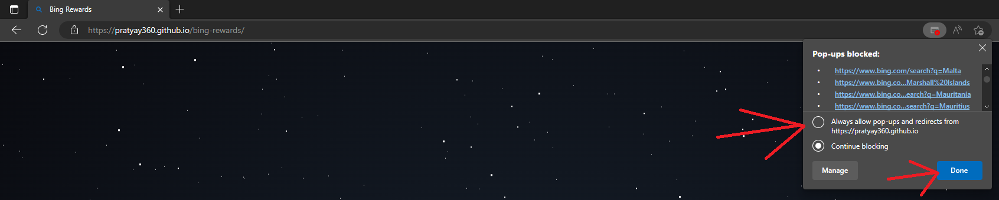
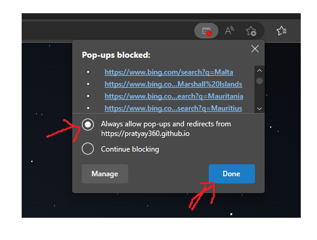
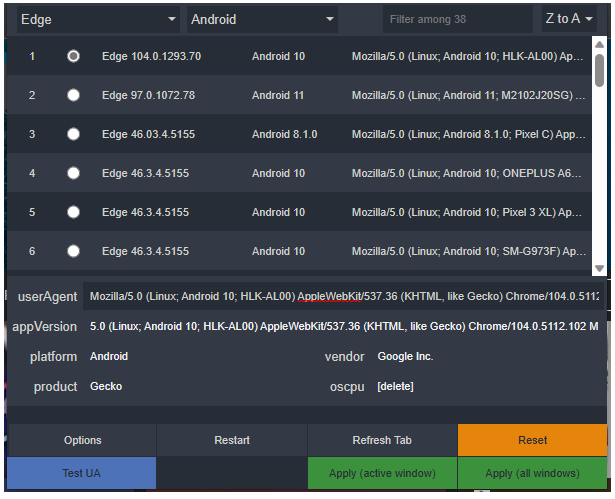
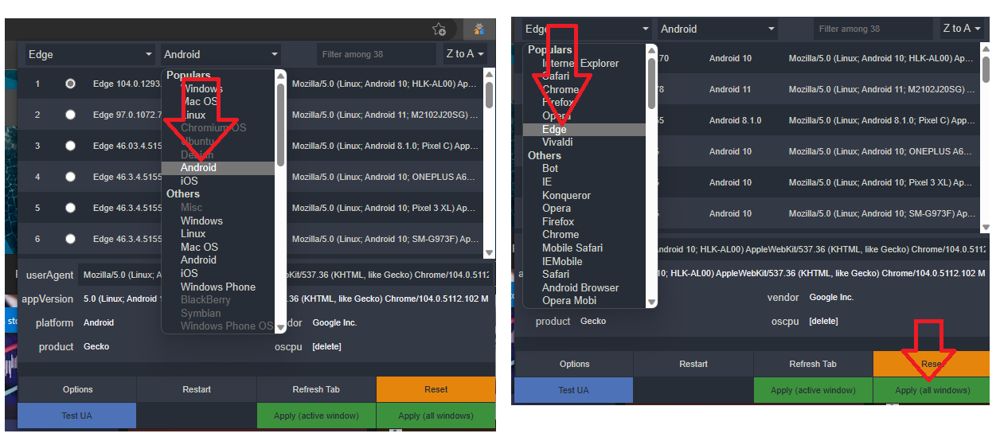

# bing-rewards

 

# Note your browser can block pop ups like this 

# allow pop ups after running for the first time.

## additionally install user agent switcher addon and set user agent to edge android to collect additional points

# download link for user agent switcher
  

## change browser to edge and os to android and click apply all

